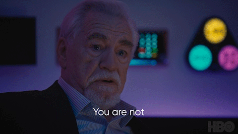

Couldn't think of a better way to express my thoughts than just to share what I posted in our [lab](https://kundajelab.github.io/) Slack.

Feel free to read below.

--

(Not sure if this is the right channel for this but) Just presented another quick lightning talk + poster session on ENCODE GRAMMAR/MotifCompendium at the Stanford Synthetic Biology Expo sb.stanford.edu/events (i promise this is the last poster session on ENCODE GRAMMAR/MC after IGVF+genetics retreat :sweat_smile:)

But I think I just felt my first real disappointment in a scientific community (in the synthetic biology community) - and just wanted to vent a little bit here.

Personally, I first started down the bio path circa 2016 when I found out about a syn bio/metabolic engineering study that synthesized artemisinin (an anti-malarial precursor) in yeast that was (hypothetically) vastly more efficient than extracting it from its rare native plant ([nature.com/articles/nature04640](https://www.nature.com/articles/nature04640) from Jay Keasling Lab in 2006, if people are interested). I just thought it was the coolest thing to engineer cells, like we do with all other parts of our lives, for the betterment of humanity. And the plan was to build genetic circuits (like in electrical engineering) to wire cells, that promised the powers of engineering: solve health (obviously), agriculture (plant engineering), energy (biofuel), petrochemical, sustainability, etc.

But 10 years on, today i just saw the _exact_ same people tell the _exact_ same narrative - with not that much more to show for than work from 10-20 years ago. Just continue to gobble up resources and talent based on "cool", "creative" (children-like) ideas.

There's many things that went wrong i think. Chaotic heterogenous cellular environments are definitely harder to engineer than pristine environments like semiconductors, chemical plants. Traditional engineering industries are harder to change, like agriculture, chemicals, energy.

But what I think they really missed (maybe a little biased given our background, but still) is the _**precise, quantitative**_ descriptions of the synthetic changes they were bringing to the cells - which (conveniently for us) only computational methods can truly capture.

Everything was just hand-wavy qualitative. You have Compound A in the cell. You need to make Compound B. So you add an enzyme that converts A to B. And then hope that everything else works out. Or you need to trigger Pathway A when Molecule B is present but not when Molecule C is present. So you add two inducible promoters to create a B AND NOT C gate. And hope that the rest holds. But what are the quantitative kinetics of Enzyme AB? Where is the localization in which the reaction takes place? What are the dynamics of the promoter activity with respect to repressor expression?

Without precise, quantitative descriptions, the error bars on the synthetic parts compound. And so while it may work as one synthetic "block", if you try to chain more blocks to create an actually useful system, the error bars go through the roof and you're no better than a random number generator predicting the effects of your "engineering".

Today, there was no appreciation for the quantitative descriptions that computational methods can bring during the poster session. Just more small-scale, proof-of-concepts flexing on "how imaginative" you can be.

The biggest irony was from the keynote. They compared synthetic biology to civil engineering building a bridge. Paraphrased: Before, we were just building huts using sticks and mud. Only once materials were standardized, like bricks and steel cables, could we start to build domes and arches, and later massive suspension bridges like we see today. So we need to standardize the biological units (like cloning, experimental protocols, transcriptional circuit modules, etc)

No: Actually, modern bridges were possible mainly because of computer aided design (CAD), that allowed precise description of the materials, tensile/compressive strength at each cubic inch + some perturbations to mimic earthquake, cars driving over, etc. If we can't precisely describe how one brick works, we for sure can't add 10,000 more.

Overall, my conclusion was that: The old guard did their job. They showed for the first time what engineering biology could look like, extended our imagination, and inspired the next generation. But the old guard must pass and the new guard must rise. The previous generation of syn bio was primarily led by biologists (and some electrical engineers). The next generation needs to be more computationally-native, that attempts to predictively describe each synthetic perturbation and component, that only then, can we actually start to build out the complex biological systems we imagined.

Rant end. 😅

--

The only meme i could think of the whole time (from succession, if people have seen it):

